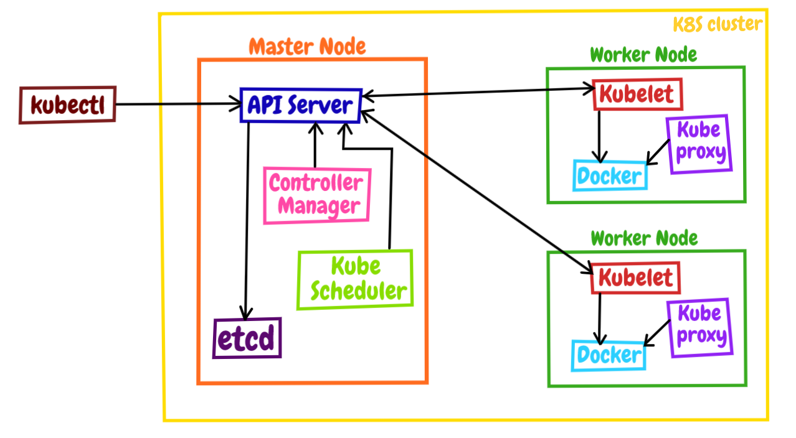

# Kubernetes

- [Kubernetes](#kubernetes)
- [Docker](#docker)
  - [1. Docker的安装（Mac）](#1-docker的安装mac)
  - [2. Docker的架构](#2-docker的架构)
  - [3. 容器的本质: 被隔离的进程](#3-容器的本质-被隔离的进程)
    - [与虚拟机的区别](#与虚拟机的区别)
    - [隔离是怎么实现的](#隔离是怎么实现的)
    - [镜像](#镜像)
      - [常用的镜像操作](#常用的镜像操作)
      - [常用的容器操作](#常用的容器操作)
    - [创建容器镜像](#创建容器镜像)
      - [镜像的内部机制](#镜像的内部机制)
      - [Dockerfile](#dockerfile)
  - [4. 镜像仓库](#4-镜像仓库)
  - [5. 容器该如何与外界互联互通](#5-容器该如何与外界互联互通)
    - [拷贝容器内的数据](#拷贝容器内的数据)
    - [共享主机上的文件](#共享主机上的文件)
    - [分配服务端口号](#分配服务端口号)
  - [6. 搭建 WordPress 网站](#6-搭建-wordpress-网站)
- [Kubernetes](#kubernetes-1)
  - [1. 在本机搭建Kubernetes环境](#1-在本机搭建kubernetes环境)
  - [2. Kubernetes 的基本架构](#2-kubernetes-的基本架构)

# Docker

## 1. Docker的安装（Mac）

> 1. 用brew进行安装

```text
brew cask install docker
```

> 2. Docker Desktop for Mac安装

官网下载链接：https://docs.docker.com/desktop/install/mac-install/

## 2. Docker的架构

官网介绍：https://docs.docker.com/get-started/overview/


敲的命令行 docker 实际上是一个客户端 client，它会与 Docker Engine 里的后台服务 Docker daemon 通信，而镜像则存储在远端的仓库 Registry 里，客户端并不能直接访问镜像仓库。

Docker client 可以通过 build、pull、run等命令向 Docker daemon 发送请求，而 Docker daemon 则是容器和镜像的“大管家”，负责从远端拉取镜像、在本地存储镜像，还有从镜像生成容器、管理容器等所有功能。所以，在 Docker Engine 里，真正干活的其实是默默运行在后台的 Docker daemon，而我们实际操作的命令行工具“docker”只是个“传声筒”的角色。  

Docker 官方还提供一个“hello-world”示例，可以为你展示 Docker client 到 Docker daemon 再到 Registry 的详细工作流程，只需要执行这样一个命令：

```text
docker run hello-world
```

## 3. 容器的本质: 被隔离的进程

> 1. 使用 docker pull 命令，拉取一个新的镜像——操作系统 Alpine

```text
docker pull alpine
```

> 2. 使用 docker run 命令运行它的 Shell 程序：

```text
docker run -it alpine sh
```     

执行 cat /etc/os-release ，还有 ps 这两个命令，最后再使用 exit 退出，看看容器里与容器外有什么不同：

```text
/ # cat /etc/os-release
NAME="Alpine Linux"
ID=alpine
VERSION_ID=3.16.2
PRETTY_NAME="Alpine Linux v3.16"
HOME_URL="https://alpinelinux.org/"
BUG_REPORT_URL="https://gitlab.alpinelinux.org/alpine/aports/-/issues"
/ # ps -ef
PID   USER     TIME  COMMAND
    1 root      0:00 sh
    7 root      0:00 ps -ef
/ # exit
```

在容器内部是一个全新的 Alpine 操作系统，在这里运行的应用程序完全看不到外面的 Ubuntu 系统，两个系统被互相“隔离”了. 使用容器技术，可以让应用程序运行在一个有严密防护的“沙盒”（Sandbox）环境之内.  

### 与虚拟机的区别


容器并不直接运行在 Docker 上，Docker 只是辅助建立隔离环境，让容器基于 Linux 操作系统运行

> 1. 容器和虚拟机的目的都是隔离资源，保证系统安全，然后是尽量提高资源的利用率。

从实现的角度来看，虚拟机虚拟化出来的是硬件，需要在上面再安装一个操作系统后才能够运行应用程序，而硬件虚拟化和操作系统都比较“重”，会消耗大量的 CPU、内存、硬盘等系统资源，但这些消耗其实并没有带来什么价值，属于“重复劳动”和“无用功”，不过好处就是隔离程度非常高，每个虚拟机之间可以做到完全无干扰。  

容器直接利用了下层的计算机硬件和操作系统，因为比虚拟机少了一层，所以自然就会节约 CPU 和内存，显得非常轻量级，能够更高效地利用硬件资源。不过，因为多个容器共用操作系统内核，应用程序的隔离程度就没有虚拟机那么高了。

一个普通的 Ubuntu 虚拟机安装完成之后，体积都是 GB 级别的，再安装一些应用很容易就会上到 10GB，启动的时间通常需要几分钟，我们的电脑上同时运行十来个虚拟机可能就是极限了。而一个 Ubuntu 镜像大小则只有几十 MB，启动起来更是非常快，基本上不超过一秒钟，同时跑上百个容器也毫无问题。  

不过，虚拟机和容器这两种技术也不是互相排斥的，它们完全可以结合起来使用，就像我们的课程里一样，用虚拟机实现与宿主机的强隔离，然后在虚拟机里使用 Docker 容器来快速运行应用程序。

### 隔离是怎么实现的

Linux 操作系统内核之中，为资源隔离提供了三种技术：namespace、cgroup、chroot.  

namespace 是 2002 年从 Linux 2.4.19 开始出现的，和编程语言里的 namespace 有点类似，它可以创建出独立的文件系统、主机名、进程号、网络等资源空间，相当于给进程盖了一间小板房，这样就实现了系统全局资源和进程局部资源的隔离。  

cgroup 是 2008 年从 Linux 2.6.24 开始出现的，它的全称是 Linux Control Group，用来实现对进程的 CPU、内存等资源的优先级和配额限制，相当于给进程的小板房加了一个天花板。  

chroot 的历史则要比前面的 namespace、cgroup 要古老得多，早在 1979 年的 UNIX V7 就已经出现了，它可以更改进程的根目录，也就是限制访问文件系统，相当于给进程的小板房铺上了地砖。


### 镜像

把运行进程所需要的文件系统、依赖库、环境变量、启动参数等所有信息打包整合到了一起。之后镜像文件无论放在哪里，操作系统都能根据这个“样板间”快速重建容器，应用程序看到的就会是一致的运行环境了。  

1. docker pull busybox ，就是获取了一个打包了 busybox 应用的镜像，里面固化了 busybox 程序和它所需的完整运行环境。
2. docker run busybox echo hello world ，就是提取镜像里的各种信息，运用 namespace、cgroup、chroot 技术创建出隔离环境，然后再运行 busybox 的 echo 命令，输出 hello world 的字符串。

这两个步骤，由于是基于标准的 Linux 系统调用和只读的镜像文件，所以，无论是在哪种操作系统上，或者是使用哪种容器实现技术，都会得到完全一致的结果。  


所谓的“容器化的应用”，或者“应用的容器化”，就是指应用程序不再直接和操作系统打交道，而是封装成镜像，再交给容器环境去运行。

镜像就是静态的应用容器，容器就是动态的应用镜像.  

#### 常用的镜像操作

docker pull 从远端仓库拉取镜像，docker images 列出当前本地已有的镜像。  

镜像的完整名字由两个部分组成，名字和标签，中间用 : 连接起来。

名字表明了应用的身份，比如 busybox、Alpine、Nginx、Redis 等等。标签（tag）则可以理解成是为了区分不同版本的应用而做的额外标记，任何字符串都可以，比如 3.15 是纯数字的版本号、jammy 是项目代号、1.21-alpine 是版本号加操作系统名等等。其中有一个比较特殊的标签叫“latest”，它是默认的标签，如果只提供名字没有附带标签，那么就会使用这个默认的“latest”标签。  

docker rmi ，它用来删除不再使用的镜像，可以节约磁盘空间，注意命令 rmi ，实际上是“remove image”的简写。  

```text
docker rmi redis    
docker rmi d4c
```

第一个 rmi 删除了 Redis 镜像，因为没有显式写出标签，默认使用的就是“latest”。第二个 rmi 没有给出名字，而是直接使用了 IMAGE ID 的前三位，也就是“d4c”，Docker 就会直接找到这个 ID 前缀的镜像然后删除。  

#### 常用的容器操作

基本的格式是“docker run 设置参数”，再跟上“镜像名或 ID”，后面可能还会有附加的“运行命令”。

```text
docker run -h srv alpine hostname
```

-h srv 就是容器的运行参数，alpine 是镜像名，它后面的 hostname 表示要在容器里运行的“hostname”这个程序，输出主机名。

-it 表示开启一个交互式操作的 Shell，这样可以直接进入容器内部，就好像是登录虚拟机一样。（它实际上是“-i”和“-t”两个参数的组合形式）  
-d 表示让容器在后台运行，这在我们启动 Nginx、Redis 等服务器程序的时候非常有用。  
--name 可以为容器起一个名字，方便我们查看，不过它不是必须的，如果不用这个参数，Docker 会分配一个随机的名字。

docker exec 命令在里面执行另一个程序，效果和 docker run 很类似，但因为容器已经存在，所以不会创建新的容器。它最常见的用法是使用 -it 参数打开一个 Shell，从而进入容器内部，例如：

```text
docker exec -it red_srv sh
```

docker stop 命令来强制停止, 这些停止运行的容器可以用 docker start 再次启动运行，如果你确定不再需要它们，可以使用 docker rm 命令来彻底删除。  

启动后要 ps 看 ID 再删除，如果稍微不注意，系统就会遗留非常多的“死”容器，占用系统资源，可以在执行 docker run 命令的时候加上一个 --rm 参数，这就会告诉 Docker 不保存容器，只要运行完毕就自动清除，省去了我们手工管理容器的麻烦。

### 创建容器镜像

#### 镜像的内部机制

镜像就是一个打包文件，里面包含了应用程序还有它运行所依赖的环境，例如文件系统、环境变量、配置参数等等。  

环境变量、配置参数这些东西还是比较简单的，随便用一个 manifest 清单就可以管理，真正麻烦的是文件系统。  

为了保证容器运行环境的一致性，镜像必须把应用程序所在操作系统的根目录，也就是 rootfs，都包含进来。虽然这些文件里不包含系统内核（因为容器共享了宿主机的内核），但如果每个镜像都重复做这样的打包操作，仍然会导致大量的冗余。可以想象，如果有一千个镜像，都基于 Ubuntu 系统打包，那么这些镜像里就会重复一千次 Ubuntu 根目录，对磁盘存储、网络传输都是很大的浪费。很自然的，我们就会想到，应该把重复的部分抽取出来，只存放一份 Ubuntu 根目录文件，然后让这一千个镜像以某种方式共享这部分数据。这个思路，也正是容器镜像的一个重大创新点：分层，术语叫“Layer”。

容器镜像内部并不是一个平坦的结构，而是由许多的镜像层组成的，每层都是只读不可修改的一组文件，相同的层可以在镜像之间共享，然后多个层像搭积木一样堆叠起来，再使用一种叫“Union FS 联合文件系统”的技术把它们合并在一起，就形成了容器最终看到的文件系统。  

可以用命令 docker inspect 来查看镜像的分层信息.

#### Dockerfile

Dockerfile 是一个纯文本，里面记录了一系列的构建指令，比如选择基础镜像、拷贝文件、运行脚本等等，每个指令都会生成一个 Layer，而 Docker 顺序执行这个文件里的所有步骤，最后就会创建出一个新的镜像出来。

看一个最简单的 Dockerfile 实例：

```text
# Dockerfile.busybox
FROM busybox                  # 选择基础镜像
CMD echo "hello world"        # 启动容器时默认运行的命令
```

第一条指令是 FROM，所有的 Dockerfile 都要从它开始，表示选择构建使用的基础镜像，相当于“打地基”，这里我们使用的是 busybox。  
第二条指令是 CMD，它指定 docker run 启动容器时默认运行的命令，这里我们使用了 echo 命令，输出“hello world”字符串。

用 docker build 命令来创建出镜像. 用 -f 参数指定 Dockerfile 文件名，后面必须跟一个文件路径，叫做“构建上下文”（build’s context），这里只是一个简单的点号，表示当前路径的意思。

```text
docker build -f Dockerfile.busybox .
```

Dockerfile 里最重要的一个指令 RUN ，它可以执行任意的 Shell 命令，比如更新系统、安装应用、下载文件、创建目录、编译程序等等，实现任意的镜像构建步骤，非常灵活。RUN 通常会是 Dockerfile 里最复杂的指令，会包含很多的 Shell 命令，但 Dockerfile 里一条指令只能是一行，所以有的 RUN 指令会在每行的末尾使用续行符 \，命令之间也会用 && 来连接，这样保证在逻辑上是一行，就像下面这样: 

```text
RUN apt-get update \
    && apt-get install -y \
        build-essential \
        curl \
        make \
        unzip \
    && cd /tmp \
    && curl -fSL xxx.tar.gz -o xxx.tar.gz\
    && tar xzf xxx.tar.gz \
    && cd xxx \
    && ./config \
    && make \
    && make clean
```

有的时候在 Dockerfile 里写这种超长的 RUN 指令很不美观，而且一旦写错了，每次调试都要重新构建也很麻烦，所以你可以采用一种变通的技巧：把这些 Shell 命令集中到一个脚本文件里，用 COPY 命令拷贝进去再用 RUN 来执行：

```text
COPY setup.sh  /tmp/                # 拷贝脚本到/tmp目录

RUN cd /tmp && chmod +x setup.sh \  # 添加执行权限
    && ./setup.sh && rm setup.sh    # 运行脚本然后再删除
```

RUN 指令实际上就是 Shell 编程，如果你对它有所了解，就应该知道它有变量的概念，可以实现参数化运行，这在 Dockerfile 里也可以做到，需要使用两个指令 ARG 和 ENV。

ARG 创建的变量只在镜像构建过程中可见，容器运行时不可见，而 ENV 创建的变量不仅能够在构建镜像的过程中使用，在容器运行时也能够以环境变量的形式被应用程序使用。  

EXPOSE，它用来声明容器对外服务的端口号，对现在基于 Node.js、Tomcat、Nginx、Go 等开发的微服务系统来说非常有用：

```text
EXPOSE 443           # 默认是tcp协议
EXPOSE 53/udp        # 可以指定udp协议
```

因为每个指令都会生成一个镜像层，所以 Dockerfile 里最好不要滥用指令，尽量精简合并，否则太多的层会导致镜像臃肿不堪。

## 4. 镜像仓库

Docker Hub: https://hub.docker.com/

> 如何在 Docker Hub 上挑选镜像

在 Docker Hub 上有官方镜像、认证镜像和非官方镜像的区别。

官方镜像是指 Docker 公司官方提供的高质量镜像（https://github.com/docker-library/official-images），都经过了严格的漏洞扫描和安全检测，支持 x86_64、arm64 等多种硬件架构，还具有清晰易读的文档，一般来说是我们构建镜像的首选，也是我们编写 Dockerfile 的最佳范例。  

官方镜像会有一个特殊的“Official image”的标记.

认证镜像，标记是“Verified publisher”，也就是认证发行商，比如 Bitnami、Rancher、Ubuntu 等。它们都是颇具规模的大公司，具有不逊于 Docker 公司的实力，所以就在 Docker Hub 上开了个认证账号，发布自己打包的镜像，有点类似我们微博上的“大 V”。  

通常来说，镜像标签的格式是应用的版本号加上操作系统。  
版本号基本上都是主版本号 + 次版本号 + 补丁号的形式。  
有的标签还会加上 slim、fat，来进一步表示这个镜像的内容是经过精简的，还是包含了较多的辅助工具。通常 slim 镜像会比较小，运行效率高，而 fat 镜像会比较大，适合用来开发调试。  

nginx:1.21.6-alpine，表示版本号是 1.21.6，基础镜像是最新的 Alpine。  
redis:7.0-rc-bullseye，表示版本号是 7.0 候选版，基础镜像是 Debian 11。  
node:17-buster-slim，表示版本号是 17，基础镜像是精简的 Debian 10。

## 5. 容器该如何与外界互联互通

### 拷贝容器内的数据

docker cp 的用法很简单，很类似 Linux 的“cp”“scp”，指定源路径（src path）和目标路径（dest path）就可以了。如果源路径是宿主机那么就是把文件拷贝进容器，如果源路径是容器那么就是把文件拷贝出容器，注意需要用容器名或者容器 ID 来指明是哪个容器的路径。  

假设当前目录下有一个“a.txt”的文件，现在我们要把它拷贝进 Redis 容器的“/tmp”目录，如果使用容器 ID，命令就会是这样：

```text
docker cp a.txt 062:/tmp
```

从容器拷贝出文件，只需要把 docker cp 后面的两个路径调换一下位置：

```text
docker cp 062:/tmp/a.txt ./b.txt
```

### 共享主机上的文件

使用 -v 参数把本机的“/tmp”目录挂载到容器里的“/tmp”目录，也就是说让容器共享宿主机的“/tmp”目录：

```text
docker run -d --rm -v /tmp:/tmp redis
```

在容器里的“/tmp”目录下随便做一些操作，比如删除文件、建立新目录等等，再回头观察一下宿主机，会发现修改会即时同步，这就表明容器和宿主机确实已经共享了这个目录。

-v 参数挂载宿主机目录的这个功能，对于我们日常开发测试工作来说非常有用，我们可以在不变动本机环境的前提下，使用镜像安装任意的应用，然后直接以容器来运行我们本地的源码、脚本，非常方便。

例子:比如我本机上只有 Python 2.7，但我想用 Python 3 开发，如果同时安装 Python 2 和 Python 3 很容易就会把系统搞乱，可以这么做：

1. 先使用 docker pull 拉取一个 Python 3 的镜像，因为它打包了完整的运行环境，运行时有隔离，所以不会对现有系统的 Python 2.7 产生任何影响。
2. 在本地的某个目录编写 Python 代码，然后用 -v 参数让容器共享这个目录。
3. 现在就可以在容器里以 Python 3 来安装各种包，再运行脚本做开发了。

```text
docker pull python:alpine
docker run -it --rm -v `pwd`:/tmp python:alpine sh
````

### 实现网络互通

Docker 提供了三种网络模式，分别是 null、host 和 bridge。

null 是最简单的模式，也就是没有网络，但允许其他的网络插件来自定义网络连接.  

host 的意思是直接使用宿主机网络，相当于去掉了容器的网络隔离（其他隔离依然保留），所有的容器会共享宿主机的 IP 地址和网卡。这种模式没有中间层，自然通信效率高，但缺少了隔离，运行太多的容器也容易导致端口冲突。

host 模式需要在 docker run 时使用 --net=host 参数，下面我就用这个参数启动 Nginx：

```text
docker run -d --rm --net=host nginx:alpine
```

第三种 bridge，也就是桥接模式，它有点类似现实世界里的交换机、路由器，只不过是由软件虚拟出来的，容器和宿主机再通过虚拟网卡接入这个网桥（图中的 docker0），那么它们之间也就可以正常的收发网络数据包了。不过和 host 模式相比，bridge 模式多了虚拟网桥和网卡，通信效率会低一些。


用 --net=bridge 来启用桥接模式，但其实并没有这个必要，因为 Docker 默认的网络模式就是 bridge，所以一般不需要显式指定。

### 分配服务端口号

一台主机上的端口号数量是有限的，而且多个服务之间还不能够冲突，但我们打包镜像应用的时候通常都使用的是默认端口，容器实际运行起来就很容易因为端口号被占用而无法启动。解决这个问题的方法就是加入一个“中间层”，由容器环境例如 Docker 来统一管理分配端口号，在本机端口和容器端口之间做一个“映射”操作，容器内部还是用自己的端口号，但外界看到的却是另外一个端口号，这样就很好地避免了冲突。

端口号映射需要使用 bridge 模式，并且在 docker run 启动容器时使用 -p 参数，形式和共享目录的 -v 参数很类似，用 : 分隔本机端口和容器端口。比如，如果要启动两个 Nginx 容器，分别跑在 80 和 8080 端口上：

```text
docker run -d -p 80:80 --rm nginx:alpine
docker run -d -p 8080:80 --rm nginx:alpine
```

## 6. 搭建 WordPress 网站

网站需要用到三个容器：WordPress、MariaDB、Nginx，直接使用 docker pull 拉取它们的镜像：

```text
docker pull wordpress:5
docker pull mariadb:10
docker pull nginx:alpine
```


MariaDB 作为后面的关系型数据库，端口号是 3306；  
WordPress 是中间的应用服务器，使用 MariaDB 来存储数据，它的端口是 80；  
Nginx 是前面的反向代理，它对外暴露 80 端口，然后把请求转发给 WordPress。

运行 MariaDB。根据说明文档，需要配置“MARIADB_DATABASE”等几个环境变量，用 --env 参数来指定启动时的数据库、用户名和密码，这里我指定数据库是“db”，用户名是“wp”，密码是“123”，管理员密码（root password）也是“123”。

```text
docker run -d --rm \
    --env MARIADB_DATABASE=db \
    --env MARIADB_USER=wp \
    --env MARIADB_PASSWORD=123 \
    --env MARIADB_ROOT_PASSWORD=123 \
    mariadb:10
```

启动之后，我们还可以使用 docker exec 命令，执行数据库的客户端工具“mysql”，验证数据库是否正常运行：

```text
docker exec -it 79d mysql -u wp -p
```

输入刚才设定的用户名“wp”和密码“123”之后，我们就连接上了 MariaDB，可以使用 show databases; 和 show tables; 等命令来查看数据库里的内容。

```
docker inspect 79d |grep IPAddress
```

来查看容器的ip地址

“WORDPRESS_DB_HOST”必须是 MariaDB 的 IP 地址，否则会无法连接数据库：

```text
docker run -d --rm \
    --env WORDPRESS_DB_HOST=172.17.0.2 \
    --env WORDPRESS_DB_USER=wp \
    --env WORDPRESS_DB_PASSWORD=123 \
    --env WORDPRESS_DB_NAME=db \
    wordpress:5
```

WordPress 容器在启动的时候并没有使用 -p 参数映射端口号，所以外界是不能直接访问的，我们需要在前面配一个 Nginx 反向代理，把请求转发给 WordPress 的 80 端口。

配置 Nginx 反向代理必须要知道 WordPress 的 IP 地址，可以用 docker inspect 命令查看

```text
server {
  listen 80;
  default_type text/html;

  location / {
      proxy_http_version 1.1;
      proxy_set_header Host $host;
      proxy_pass http://172.17.0.6;
  }
}
```

有了这个配置文件，需要用 -p 参数把本机的端口映射到 Nginx 容器内部的 80 端口，再用 -v 参数把配置文件挂载到 Nginx 的“conf.d”目录下。这样，Nginx 就会使用刚才编写好的配置文件，在 80 端口上监听 HTTP 请求，再转发到 WordPress 应用：

```text
docker run -d --rm \
    -p 80:80 \
    -v `pwd`/wp.conf:/etc/nginx/conf.d/default.conf \
    nginx:alpine
```

三个容器都启动之后，再用 docker ps 来看看它们的状态：

# Kubernetes

Kubernetes 就是一个生产级别的容器编排平台和集群管理系统，不仅能够创建、调度容器，还能够监控、管理服务器，它凝聚了 Google 等大公司和开源社区的集体智慧，从而让中小型公司也可以具备轻松运维海量计算节点——也就是“云计算”的能力。

## 1. 在本机搭建Kubernetes环境

> 1. 安装minikube：https://minikube.sigs.k8s.io/docs/start/  

安装完成之后，你可以执行命令 minikube version，看看它的版本号，验证是否安装成功

minikube 只能够搭建 Kubernetes 环境，要操作 Kubernetes，还需要另一个专门的客户端工具“kubectl”。

> 2. 安装kubectl

```text
minikube kubectl
```

所以，在 minikube 环境里，我们会用到两个客户端：minikube 管理 Kubernetes 集群环境，kubectl 操作实际的 Kubernetes 功能，和 Docker 比起来有点复杂。


> 验证 minikube 环境

使用命令 minikube start 会从 Docker Hub 上拉取镜像，以当前最新版本的 Kubernetes 启动集群。不过为了保证实验环境的一致性，我们可以在后面再加上一个参数 --kubernetes-version，明确指定要使用 Kubernetes 版本。

```text
minikube start --kubernetes-version=v1.23.3
```

使用 minikube status、minikube node list这两个命令来查看集群的状态：

```text
minikube status
minikube node list
```

Kubernetes 集群里现在只有一个节点，名字就叫“minikube”，类型是“Control Plane”，里面有 host、kubelet、apiserver 三个服务，IP 地址。

查看版本

```text
minikube kubectl -- version 
```

为了避免这个麻烦，用 Linux 的“alias”功能，为它创建一个别名，写到当前用户目录下的 .bashrc 里：

```text
alias kubectl="minikube kubectl --"
```

在 Kubernetes 里运行一个 Nginx 应用，命令与 Docker 一样，也是 run，不过形式上有点区别，需要用 --image 指定镜像，然后 Kubernetes 会自动拉取并运行：

```text
kubectl run ngx --image=nginx:alpine
```

## 2. Kubernetes 的基本架构



Kubernetes 采用了“控制面 / 数据面”（Control Plane / Data Plane）架构，集群里的计算机被称为“节点”（Node），可以是实机也可以是虚机，少量的节点用作控制面来执行集群的管理维护工作，其他的大部分节点都被划归数据面，用来跑业务应用。

控制面的节点在 Kubernetes 里叫做 Master Node，一般简称为 Master，它是整个集群里最重要的部分，可以说是 Kubernetes 的大脑和心脏。  
数据面的节点叫做 Worker Node，一般就简称为 Worker 或者 Node，相当于 Kubernetes 的手和脚，在 Master 的指挥下干活。  
Node 的数量非常多，构成了一个资源池，Kubernetes 就在这个池里分配资源，调度应用。因为资源被“池化”了，所以管理也就变得比较简单，可以在集群中任意添加或者删除节点。

kubectl，它就是 Kubernetes 的客户端工具，用来操作 Kubernetes，但它位于集群之外，理论上不属于集群。

用命令 kubectl get node 来查看 Kubernetes 的节点状态.


