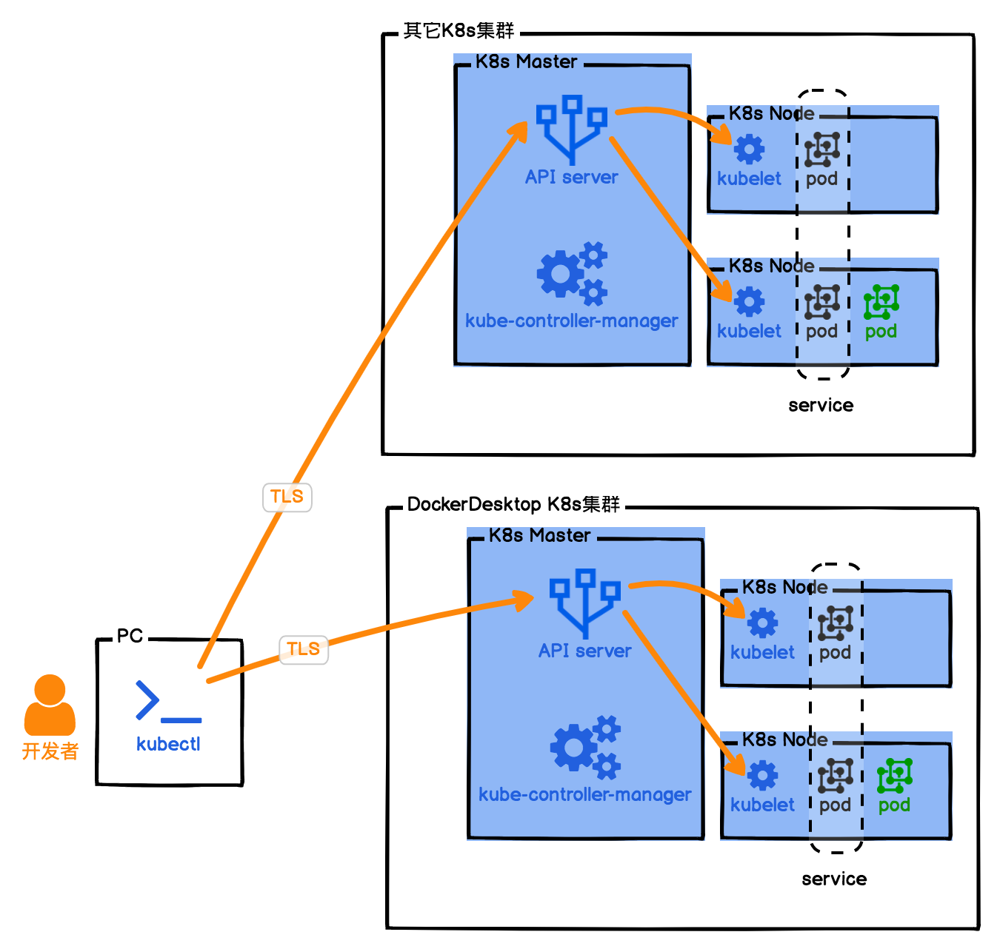

# K8s和云原生CNCF搭建私有Serverless

## 1. PC 上的 K8s

操作系统是 MacOS 或者 Windows桌面版的 Docker 已经自带了K8s，要顺利启动桌面版 Docker 自带的 K8s，还得解决国内 Docker 镜像下载不了的问题，以下步骤进行操作：  

1. 开通阿里云的容器镜像仓库；
2. 在阿里云的容器镜像服务里，找到镜像加速器，复制你的镜像加速器地址；
3. 打开桌面版 Docker 的控制台，找到 Docker Engine。  

```json
{
  "registry-mirrors" : [
    "https://你的加速地址.mirror.aliyuncs.com"
  ],
  "debug" : true,
  "experimental" : true
}
```

1. 预下载 K8s 所需要的所有镜像，执行我目录下的 docker-k8s-prefetch.sh；  

```text
chmode +x docker-k8s-prefetch.sh
./docker-k8s-prefetch.sh
```

5. 上面拉取完运行 K8s 所需的 Docker 镜像，你就可以在桌面版 Docker 的 K8s 项中，勾选启动 K8s 了。  

启动成功后，继续执行下面的命令。  
查看安装好的 K8s 系统运行状况。  

```text
kubectl get all -n kube-system
```

查看 K8s 有哪些配置环境，对应~/.kube/config。

```text
kubectl config get-contexts
```

查看当前 K8s 环境的整体情况。

```text
kubectl get all
```



PC 本地安装 kubectl 是 K8s 的命令行操作工具，通过它，我们就可以控制 K8s 集群了。又因为 kubectl 是通过加密通信的，所以我们可以在一台电脑上同时控制多个 K8s 集群，不过需要指定当前操作的上下文 context。这个也就是云原生的重要理念，我们的架构可以部署在多套云服务环境上。  

在 K8s 集群中，Master 节点很重要，它是我们整个集群的中枢。没错，Master 节点就是 Stateful 的。Master 节点由 API Server、etcd、kube-controller-manager 等几个核心成员组成，它只负责维持整个 K8s 集群的状态，为了保证职责单一，Master 节点不会运行我们的容器实例。  

Worker 节点，也就是 K8s Node 节点，才是我们部署的容器真正运行的地方，但在 K8s 中，运行容器的最小单位是 Pod。一个 Pod 具备一个集群 IP 且端口共享，Pod 里可以运行一个或多个容器，但最佳的做法还是一个 Pod 只运行一个容器。这是因为一个 Pod 里面运行多个容器，容器会竞争 Pod 的资源，也会影响 Pod 的启动速度；而一个 Pod 里只运行一个容器，可以方便我们快速定位问题，监控指标也比较明确。  

在 K8s 集群中，它会构建自己的私有网络，每个容器都有自己的集群 IP，容器在集群内部可以互相访问，集群外却无法直接访问。因此我们如果要从外部访问 K8s 集群提供的服务，则需要通过 K8s service 将服务暴露出来才行。  


