# K8s和云原生CNCF搭建私有Serverless

- [K8s和云原生CNCF搭建私有Serverless](#k8s和云原生cncf搭建私有serverless)
  - [1. PC 上的 K8s](#1-pc-上的-k8s)
  - [2. todolist demo](#2-todolist-demo)
  - [3. K8s 如何实现扩缩容](#3-k8s-如何实现扩缩容)
  - [4. 搭建 Serverless](#4-搭建-serverless)
    - [4.1. Serverless 底座：Service Mesh](#41-serverless-底座service-mesh)
    - [4.2. Serverless 底座搭建：K8s 组件 Istio](#42-serverless-底座搭建k8s-组件-istio)
  - [5. Serverless 完整实现：K8s 组件 Knative](#5-serverless-完整实现k8s-组件-knative)
  - [6. 参考资料](#6-参考资料)

## 1. PC 上的 K8s

操作系统是 MacOS 或者 Windows桌面版的 Docker 已经自带了K8s，要顺利启动桌面版 Docker 自带的 K8s，还得解决国内 Docker 镜像下载不了的问题，以下步骤进行操作：  

1. 开通阿里云的容器镜像仓库；
2. 在阿里云的容器镜像服务里，找到镜像加速器，复制你的镜像加速器地址；
3. 打开桌面版 Docker 的控制台，找到 Docker Engine。  

```json
{
  "registry-mirrors" : [
    "https://你的加速地址.mirror.aliyuncs.com"
  ],
  "debug" : true,
  "experimental" : true
}
```

1. 预下载 K8s 所需要的所有镜像，执行我目录下的 docker-k8s-prefetch.sh；  

```text
chmode +x docker-k8s-prefetch.sh
./docker-k8s-prefetch.sh
```

5. 上面拉取完运行 K8s 所需的 Docker 镜像，你就可以在桌面版 Docker 的 K8s 项中，勾选启动 K8s 了。  

启动成功后，继续执行下面的命令。  
查看安装好的 K8s 系统运行状况。  

```text
kubectl get all -n kube-system
```

查看 K8s 有哪些配置环境，对应~/.kube/config。

```text
kubectl config get-contexts
```

查看当前 K8s 环境的整体情况。

```text
kubectl get all
```


PC 本地安装 kubectl 是 K8s 的命令行操作工具，通过它，我们就可以控制 K8s 集群了。又因为 kubectl 是通过加密通信的，所以我们可以在一台电脑上同时控制多个 K8s 集群，不过需要指定当前操作的上下文 context。这个也就是云原生的重要理念，我们的架构可以部署在多套云服务环境上。  

在 K8s 集群中，Master 节点很重要，它是我们整个集群的中枢。没错，Master 节点就是 Stateful 的。Master 节点由 API Server、etcd、kube-controller-manager 等几个核心成员组成，它只负责维持整个 K8s 集群的状态，为了保证职责单一，Master 节点不会运行我们的容器实例。  

Worker 节点，也就是 K8s Node 节点，才是我们部署的容器真正运行的地方，但在 K8s 中，运行容器的最小单位是 Pod。一个 Pod 具备一个集群 IP 且端口共享，Pod 里可以运行一个或多个容器，但最佳的做法还是一个 Pod 只运行一个容器。这是因为一个 Pod 里面运行多个容器，容器会竞争 Pod 的资源，也会影响 Pod 的启动速度；而一个 Pod 里只运行一个容器，可以方便我们快速定位问题，监控指标也比较明确。  

在 K8s 集群中，它会构建自己的私有网络，每个容器都有自己的集群 IP，容器在集群内部可以互相访问，集群外却无法直接访问。因此我们如果要从外部访问 K8s 集群提供的服务，则需要通过 K8s service 将服务暴露出来才行。  

## 2. todolist demo

1. 先确认一下，当前的操作是在正确的 K8s 集群上下文中。对应我们的例子里，也就是看当前选中的集群是不是 docker-desktop。

```text
kubectl config get-contexts
```

如果不对，则需要执行切换集群：

```text
kubectl config use-context docker-desktop
```

添加一下拉取镜像的证书服务：

```text
kubectl create secret docker-registry regcred --docker-server=registry.cn-shanghai.aliyuncs.com --docker-username=你的容器镜像仓库用户名 --docker-password=你的容器镜像仓库密码
```

在镜像仓库中可以设置这个仓库：公开或者私有。如果是操作系统的镜像，设置为公开是完全没有问题的，所有人都可以下载我们的公开镜像；但如果是我们自己的应用镜像，还是需要设置成私有，下载私有镜像需要验证用户身份，也就是 Docker Login 的操作。因为我们应用的镜像仓库中，包含我们的最终运行代码，往往会有我们数据库的登录用户名和密码，或者我们云服务的 ak/sk，这些重要信息如果泄露，很容易让我们的应用受到攻击。  

当你添加完 secret 后，就可以通过下面的命令来查看 secret 服务了：

```text
kubectl get secret regcred
```

部署项目

```text
kubectl apply -f myapp.yaml
```

这句话的意思就是，告诉 K8s 集群，请按照我的部署文件 myapp.yaml，部署我的应用。  

1. 首先我们指定要创建一个 service/myapp，它选中打了"app:myapp"标签的 Pod，集群内访问端口号 3001，并且暴露 service 的端口号 30512。
2. 然后我们创建了部署服务 deployment.apps/myapp，它负责保持我们的 Pod 数量恒久为 1，并且给 Pod 打上"app:myapp"的标签，也就是负责我们的 Pod 持久化，一旦 Pod 挂了，部署服务就会重新拉起一个。
3. 最后我们的容器服务，申明了自己的 Docker 镜像是什么，拉取镜像的 secret，以及需要什么资源。

实现“待办任务”Web 服务版本的K8s 的原理图

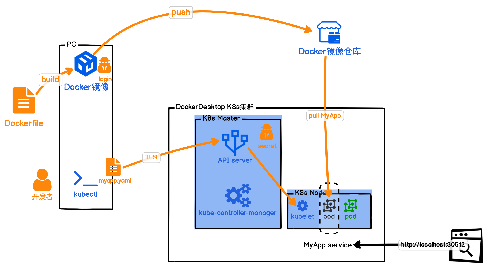

只需要将云服务商提供的 K8s 环境添加到我们 kubectl 的配置文件中，就可以让我们的应用运行在云服务商的 K8s 环境中了。目前所有的较大的云服务商都已经加入 CNCF，所以当你掌握 K8s 后，就可以根据云服务商的价格和自己喜好，自由地选择将你的 K8s 集群部署在 CNCF 成员的云服务商上，甚至你也可以在自己的机房搭建 K8s 环境，部署你的应用。  

## 3. K8s 如何实现扩缩容

K8s 其实还向我们隐藏了一部分内容，就是它自身的服务状态。而我们不指定命名空间，默认的命名空间其实是 default 空间。要查看 K8s 集群系统的运行状态，我们可以通过指定 namespace 为 kube-system 来查看。K8s 集群通过 namespace 隔离，一定程度上，隐藏了系统配置，这可以避免我们误操作。另外它也提供给我们一种逻辑隔离手段，将不同用途的服务和节点划分开来。  

K8s 自己的服务也是运行在自己的集群中的，不过是通过命名空间，将自己做了隔离。  

可以通过给 K8s 安装组件 Component，扩展 K8s 的能力.性能指标 metrics 组件.  

根目录下已经准备好了 metric 组件的 YAML 文件，只需要执行安装就可以了：

```text
kubectl apply -f metrics-components.yaml
```

K8s 的系统命名空间：

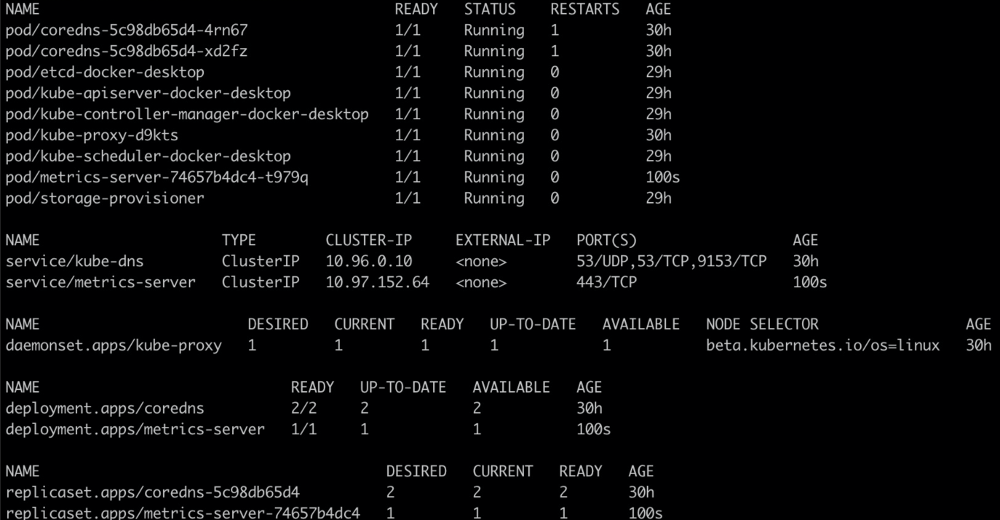

执行下面的命令看metrics 组件

```text
kubectl top node
```

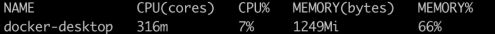

有了实时的监控指标，那么我们就可以依赖这个指标，来做我们的自动扩缩容了：

```text
kubectl autoscale deployment myapp --cpu-percent=30 --min=1 --max=3
```

添加一个自动扩缩容部署服务，cpu 水位是 30%，最小维持 1 个 Pod，最大维持 3 个 Pod。执行完后，我们就发现会多了一个部署服务。  

```text
kubectl get hpa
```

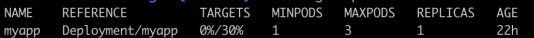

模拟压测

```text
kubectl run -i --tty load-generator --image=busybox /bin/sh
$ while true; do wget -q -O- http://10.1.0.16:3001/api/rule; done
```

用一个 K8s 的 Pod，启动 busybox 镜像，执行死循环，压测我们的 MyApp 服务。不过我们目前用 Node.js 实现的应用可以扛住的流量比较大，单机模拟的压测，轻易还压测不到扩容的水位。  

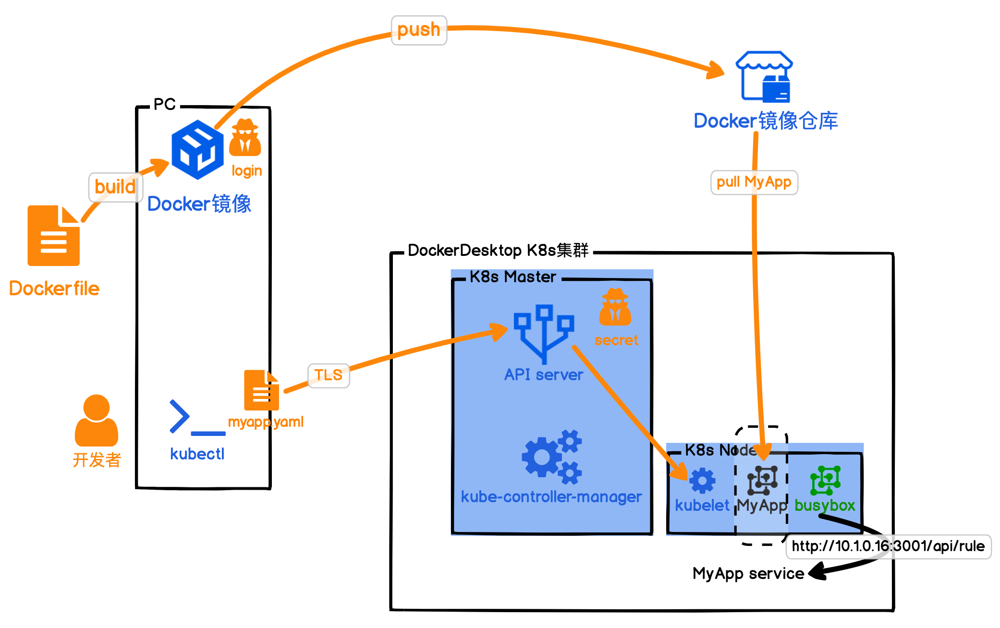

## 4. 搭建 Serverless

将 Serverless 架构的网络通讯托管给 ServiceMesh。通过 Service Mesh，Serverless 组件可以和 K8s 集群复杂且精密地配合在一起，最终支撑我们部署的应用 Serverless 化。

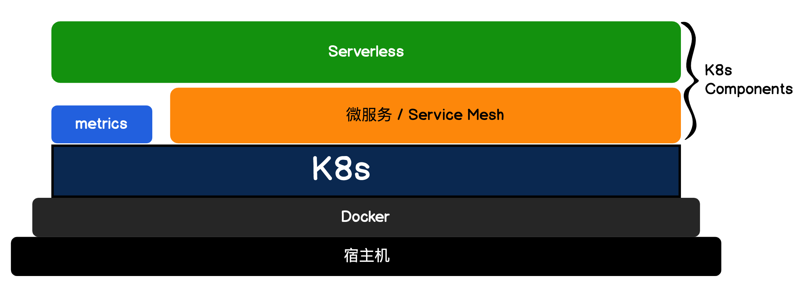

Serverless 的底层可以基于 Service Mesh 来搭建。但 Service Mesh 其实只是实现 Serverless 网络通讯的其中一种方案，除此之外还有 RSocket、gRPC、Dubbo 等方案，而我选择 Service Mesh 的原因是这套方案是可以基于 K8s 组件的，而且还提供了可视化工具帮助我们理解 Serverless 的运行机制.  

### 4.1. Serverless 底座：Service Mesh

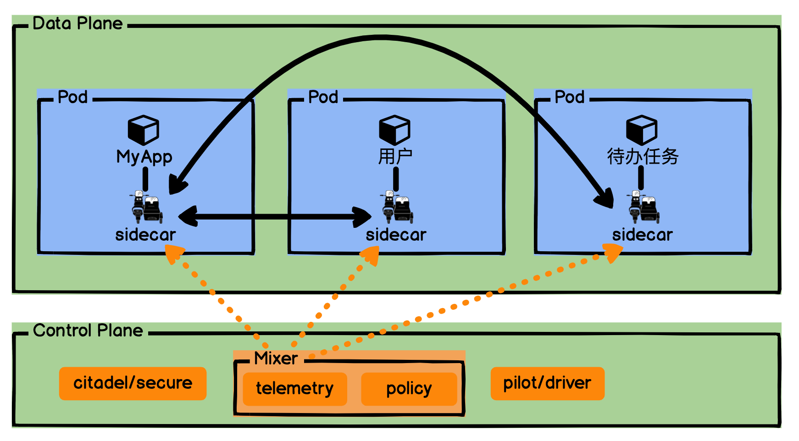

Service Mesh 可以分为数据面板和控制面板，数据面板负责接管我们的网络通讯；控制面板则控制和反馈网络通讯的状态。Service Mesh 将我们网络的通讯通过注入一个边车 Sidecar 全部承接了过去。  

数据面板中我们的应用和微服务，看上去直接跟 Sidecar 通信，但实际上，Sidecar 可以通过流量劫持来实现，所以通常我们的应用和微服务是无感的，不用有任何的改动，只是使用 HTTP 请求数据。  

控制面板则复杂一些，它也是 Service Mesh 的运作核心。pilot 是整个 Control Plane 的驾驶员，它负责服务发现、流量管理和扩缩容；citadel 则是控制面板的守护堡垒，它负责安全证书和鉴权；Mixer 则是通讯官，将我们控制面板的策略下发，并且收集每个服务的运行状况。  

### 4.2. Serverless 底座搭建：K8s 组件 Istio

动手搭建 Service Mesh  

首先，得扩大一下 Docker Desktop 操作系统的占用资源，在搭建的过程中需要创建一堆容器。推荐将 CPUs 配置到 4 核，内存至少 8GB。  

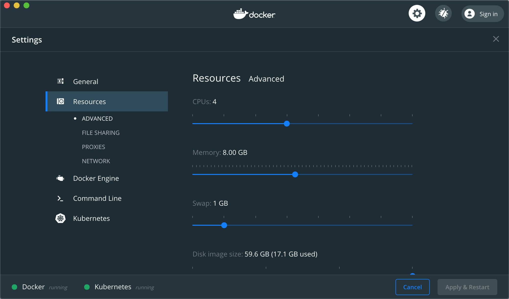

设置好后，我们需要用到 CNCF 的另外一位重要成员 Istio了，它是在 K8s 上 Service Mesh 的实现方式，用于连接、保护、控制和观测服务。  

进入根目录下的 install-istio，这里 Istio 官方其实提供了 Istio 1.4.3 K8s 安装包.  

然后 kubectl apply 安装 Istio。

```text
kubectl apply -f .
```

安装完毕后，就可以通过命名空间 istio-system 来查看 Istio 是否安装成功。  

```text
kubectl get all -n istio-system
```

Istio 也是采用 K8s 组件 Component 的方式来安装的。默认 Istio 不会开启 Sidecar 注入，这个需要我们手动开启。  

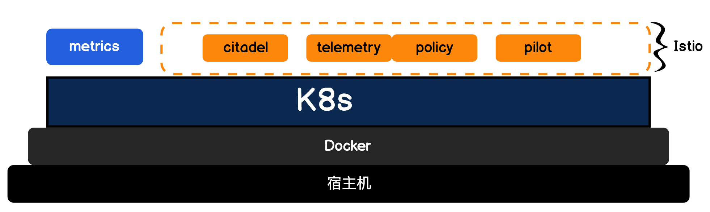

可以通过给命名空间 default 打上 label，让我们部署的 Pod 自动打开 Sidecar。

```text
kubectl label ns default istio-injection=enabled
```

Istio 会根据我们的标签去判断，当前部署的应用是否需要开启 Sidecar。

```text
kubectl describe ns default
```

将项目目录下的 Dockerfile、Dockerfile-rule、Dockerfile-user 都用 Docker 构建一遍，并且上传到我们的 Registry。  

```text
docker build --force-rm -t registry.cn-shanghai.aliyuncs.com/jike-serverless/todolist:master -f Dockerfile .
docker build --force-rm -t registry.cn-shanghai.aliyuncs.com/jike-serverless/rule:master -f Dockerfile-rule .
docker build --force-rm -t registry.cn-shanghai.aliyuncs.com/jike-serverless/user:master -f Dockerfile-user .
docker push registry.cn-shanghai.aliyuncs.com/jike-serverless/todolist:master
docker push registry.cn-shanghai.aliyuncs.com/jike-serverless/rule:master
docker push registry.cn-shanghai.aliyuncs.com/jike-serverless/user:master
```

然后修改项目 istio-myapp 目录中的 YAML 文件，改成你自己仓库中的 URI。接着在 istio-myapp 目录下执行，kubectl apply“点”部署所有 YAML 文件。

```text
kubectl apply -f .
```

部署完成后，通过 kubectl describe 查看一下 MyApp 服务暴露的端口号：

```text
kubectl describe service/myapp
```

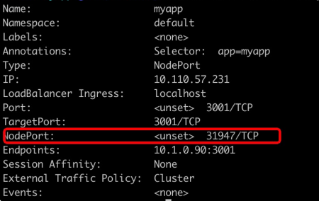

接下来我们用浏览器访问http://localhost:31947，就可以看到我们新部署的 MyApp 应用了。  

Istio 都做了什么？将 Istio 的控制面板服务 kiali 通过 Service 暴露到端口上，访问一下。

```text
kubectl expose deployment.apps/kiali --type=NodePort --port=20001 --name='kiali-local' -n istio-system
```

然后查看一下 kiali 的本地端口号。  

```text
kubectl describe svc kiali-local -n istio-system
```

接着用浏览器打开 kiali，进入后你就可以看到我们应用调用微服务的网络拓扑图了。

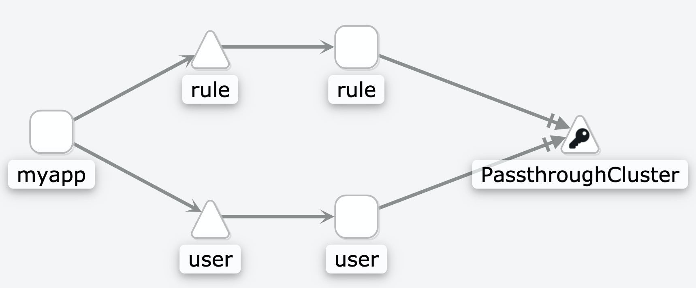

Service Mesh 可以协助我们处理应用和微服务网络的连接、保护、控制和观测问题。  

可以通过 kubectl delete 清除刚刚部署的应用，注意要在 istio-myapp 目录下执行。

```text
kubectl delete -f .
```

## 5. Serverless 完整实现：K8s 组件 Knative

Knative 是通过整合：工作负载管理（和动态扩缩）以及事件模型来实现的 Serverless 标准，也叫容器化 Serverless。  

Knative 在 Istio 的基础上，加上了流量管控和灰度发布能力、路由 Route 控制、版本 Revision 快照和自动扩缩容，就组成了 Server 集合；它还将触发器、发布管道 Pipeline 结合起来组成了 Event 集合。  

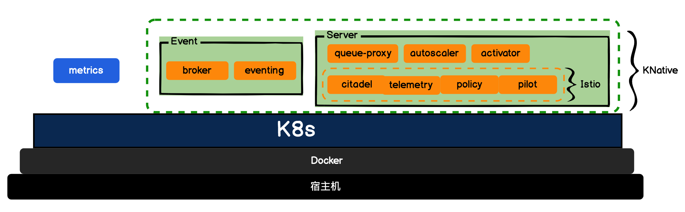

Knative 提供的应用托管服务可以大大降低直接操作 K8s 资源的复杂度和风险，提升应用的迭代和服务交付效率。  

首先进入项目 install-knative 目录，执行 kubectl apply 安装 Knative。

```text
kubectl apply -f .
```

安装完毕，你就可以通过命名空间 knative-eventing 和 knative-serving，看到我们都安装了哪些组件。

```text
kubectl get all -n knative-serving
kubectl get all -n knative-eventing
```

Knative 帮我们部署了一套自动运维托管应用的服务，因此我们要部署应用，才能看到效果。我们再进入项目 knative-myapp 目录，执行 kubectl apply。

```text
kubectl apply -f .
```

通过 get kservice 我们就可以查看部署的应用域名。

```text
kubectl get ksvc
```

这个域名其实是通过 Istio-ingress 部署的,再看 Istio-ingressgateway 的信息。

```text
kubectl get svc istio-ingressgateway -n istio-system
```

可以看到，它绑定到我们本地 IP:localhost 上了，所以我们只需要添加一下 Host，绑定我们 MyApp 的域名到 127.0.0.1 就可以了。

```text
// Mac上host文件地址是/etc/hosts
127.0.0.1 myapp.default.example.com
```

可以用浏览器直接访问我们的域名 myapp.default.example.com，进入“待办任务”Web 服务了。如果你多刷新几次页面就可以看到右上角我的名字，有时是“ABC”有时是“ABC D”。这其实是因为我的 user 服务开启了 2 个版本，而且我设置了 50% 的流量进入版本 v1，50% 的流量进入版本 v2。另外我们还需要在页面上多点击几下，这是为了让我们查看 Kiali 的网络拓扑图时有数据。

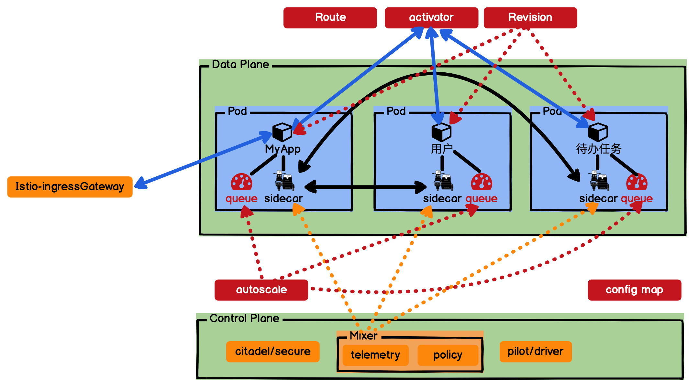

红色表示 Knative 添加的组件，橙色表示 Istio 的组件。首先看到 Knative 又给每个 Pod 里面添加了一个伴生容器 queue，它是专门用来实时采集反馈我们部署应用容器的监控指标 metrics 的，收集到的信息会反馈到 autoscale，由 autoscale 决定是否需要扩缩容。

浏览器的 HTTP 请求是访问 Istio-ingressGateway 的，我们还需要绑定域名。这是因为 Istio-ingressGateway 是域名网关，它会验证请求的域名。我们的 MyApp 应用，接收到请求会调用用户微服务和待办任务微服务，这时就会访问 activator 了，这个是 Knative 比较重要的组件，它会 hold 住我们的请求，并查看一下目前有没有活跃的服务，如果没有，它会负责拉起一个服务，等服务启动后，再将请求转接过去。这也就是为什么 Serverless 可以缩容到 0 的原因。  

当autoscale 配置了可以缩容到 0，如果一段时间没有请求，那么我们每个应用都会处于很低的水位，这时 autoscale 就会缩容到 0 了。当然我们的 MyApp 应用不可以缩容到 0，因为它需要接收入口请求。  

当 MyApp 有流量进来请求用户服务时，此时 activator 就会临时接收请求，让请求等待；然后通知 autoscale 扩容到 1；等待 autoscale 扩容到 1 完毕后，activator 再让用户容器处理等待的请求。  

在 Knative 中每次发布服务，都会被 Revision 组件拍一个快照，这个快照可以用于我们管理版本号和灰度流量分配。我们“待办任务”Web 服务中的用户微服务的 2 个版本流量切换，其实就是利用 Revision 和 Route 实现的。  

## 6. 参考资料

https://developer.aliyun.com/article/658800  
https://time.geekbang.org/column/article/232648  
